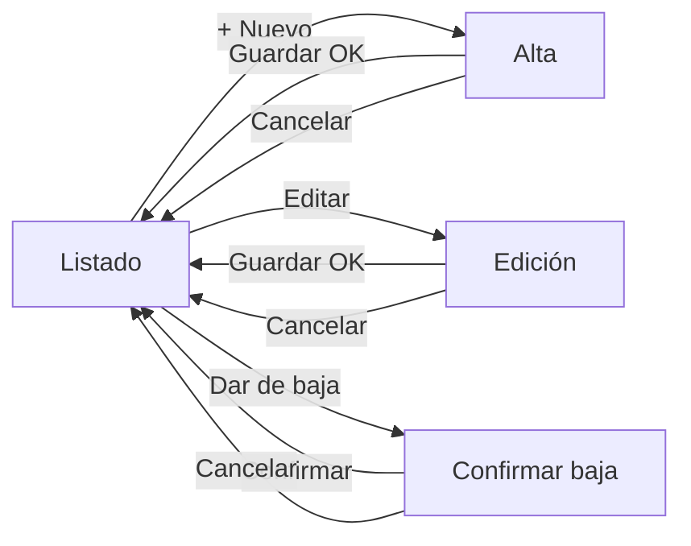

# CRUD de Productos — Campos y diseño de pantallas

Workshop 3 · Checkpoint 1 · Team **grupo21**

---

## 1. Campos que se almacenan por producto

| Campo | Tipo | Obligatorio | Reglas | Por qué está |
| --- | --- | --- | --- | --- |
| `id` | Entero autoincremental | Sí (automático) | Lo genera la base | Identificador interno. El usuario nunca lo escribe. |
| `codigo` | Texto (30) | Sí | **Único**, sin espacios | Es cómo el usuario identifica el producto (PRD-001). Que sea único evita cargar dos veces la misma cosa. |
| `nombre` | Texto (150) | Sí | Mínimo 2 caracteres | Lo que se lee en la lista y en las ventas. |
| `descripcion` | Texto largo | No | Hasta 1000 caracteres | Detalle opcional: medidas, color, presentación. |
| `unidad` | Lista cerrada | Sí | UNIDAD / KG / LITRO / METRO / CAJA | Sin esto, "5" es ambiguo: ¿cinco kilos o cinco cajas? |
| `precio` | Decimal(12,2) | Sí | **Mayor a 0** | Precio de venta vigente. Decimal y no float: con plata, el redondeo importa. |
| `stock` | Decimal(12,2) | Sí | **No negativo** | Existencias actuales. |
| `stock_minimo` | Decimal(12,2) | Sí | No negativo | Umbral de reposición: por debajo, el sistema avisa. Es lo que después alimenta la sugerencia de compra por IA. |
| `activo` | Booleano | Sí (automático) | Arranca en `true` | Baja lógica. Ver la aclaración de abajo. |
| `creado_en` | Fecha y hora | Sí (automático) | — | Auditoría: cuándo se dio de alta. |
| `actualizado_en` | Fecha y hora | Sí (automático) | — | Auditoría: última modificación. |

### Campos que decidimos NO incluir (y por qué)

- **Costo de compra** — entra recién con el módulo de compras; hoy no habría de dónde sacarlo.
- **Categoría / rubro** — útil, pero agrega otra tabla (ABM de categorías) que no es parte de este workshop.
- **Foto del producto** — implica manejo de archivos; no aporta a las 4 operaciones del CRUD.

### Aclaración importante sobre la "D" de CRUD

La **D** (Delete) está implementada como **baja lógica**: el botón "Dar de baja" pone `activo = false`, no borra la fila.

Si se borrara de verdad, cualquier venta histórica que referencia ese producto quedaría apuntando a la nada y los informes dejarían de cerrar. Por eso la lista tiene un filtro "Todos" que muestra también los dados de baja, con la opción de reactivarlos.

---

## 2. Diseño de pantallas

Cuatro pantallas cubren las cuatro operaciones:

| Pantalla | Operación | Ruta |
| --- | --- | --- |
| Listado | **R**ead | `/productos` |
| Alta | **C**reate | `/productos/nuevo` |
| Edición | **U**pdate | `/productos/<id>/editar` |
| Confirmación de baja | **D**elete | `/productos/<id>/baja` |

### 2.1 Listado de productos (Read)

```
┌──────────────────────────────────────────────────────────────────────────┐
│  ERP grupo21                                      Productos │ Clientes   │
├──────────────────────────────────────────────────────────────────────────┤
│                                                                          │
│  Productos                                        [ + Nuevo producto ]   │
│  5 productos activos                                                     │
│                                                                          │
│  ┌────────────────────────────────┐ ┌──────────────┐ ┌────────┐          │
│  │ Buscar por código o nombre...  │ │ Solo activos▾│ │ Buscar │          │
│  └────────────────────────────────┘ └──────────────┘ └────────┘          │
│                                                                          │
│  ┌──────────┬──────────────────┬──────────┬─────────┬────────┬────────┐  │
│  │ CÓDIGO   │ NOMBRE           │   PRECIO │   STOCK │ ESTADO │ ACCIÓN │  │
│  ├──────────┼──────────────────┼──────────┼─────────┼────────┼────────┤  │
│  │ PRD-001  │ Chapa galv. 1x2m │ $18.500,00│  110 un │  (OK)  │ Editar │  │
│  │          │ Espesor 0.9mm    │          │         │        │  Baja  │  │
│  ├──────────┼──────────────────┼──────────┼─────────┼────────┼────────┤  │
│  │ PRD-004  │ Electrodo 2.5mm  │ $15.300,00│    8 un │(REPONER)│ Editar │ │
│  │          │ Caja x 5kg       │          │         │        │  Baja  │  │
│  └──────────┴──────────────────┴──────────┴─────────┴────────┴────────┘  │
│                                                                          │
└──────────────────────────────────────────────────────────────────────────┘
```

**Decisiones de esta pantalla:**
- La **búsqueda es por GET**: la URL queda `?q=chapa`, se puede compartir y funciona sin JavaScript.
- La columna **Estado** resume de un vistazo lo que importa: `OK`, `REPONER` (stock ≤ mínimo) o `Dado de baja`.
- Los productos inactivos se ven grisados y solo aparecen con el filtro en "Todos".

### 2.2 Alta de producto (Create)

```
┌──────────────────────────────────────────────────────────────────────────┐
│  Productos / Nuevo producto                                              │
├──────────────────────────────────────────────────────────────────────────┤
│                                                                          │
│   Código *                        Unidad de medida *                     │
│   ┌────────────────────┐          ┌────────────────────┐                 │
│   │ PRD-006            │          │ UNIDAD           ▾ │                 │
│   └────────────────────┘          └────────────────────┘                 │
│                                                                          │
│   Nombre *                                                               │
│   ┌──────────────────────────────────────────────────┐                   │
│   │                                                  │                   │
│   └──────────────────────────────────────────────────┘                   │
│                                                                          │
│   Descripción                                                            │
│   ┌──────────────────────────────────────────────────┐                   │
│   │                                                  │                   │
│   └──────────────────────────────────────────────────┘                   │
│                                                                          │
│   Precio *          Stock inicial *      Stock mínimo *                  │
│   ┌────────────┐    ┌────────────┐       ┌────────────┐                  │
│   │ 0.00       │    │ 0          │       │ 0          │                  │
│   └────────────┘    └────────────┘       └────────────┘                  │
│                                                                          │
│   [ Crear producto ]   Cancelar                                          │
│                                                                          │
└──────────────────────────────────────────────────────────────────────────┘
```

**Con error de validación**, el mismo formulario se vuelve a mostrar con los datos ya cargados (para no hacer reescribir todo) y el mensaje debajo del campo:

```
   Código *
   ┌────────────────────┐
   │ PRD-001            │  ← borde rojo
   └────────────────────┘
   ⚠ Ya existe un producto con ese código
```

### 2.3 Edición (Update)

Mismo formulario que el alta, con tres diferencias:

- Título "Editar producto" y los campos precargados.
- El botón dice "Guardar cambios".
- Se muestra la fecha de última modificación al pie.

### 2.4 Baja (Delete)

Una baja nunca es de un clic: primero se pregunta.

```
┌────────────────────────────────────────────────────────┐
│  ¿Dar de baja este producto?                           │
├────────────────────────────────────────────────────────┤
│                                                        │
│   PRD-004 — Electrodo 2.5mm                            │
│   Stock actual: 8 UNIDAD                               │
│                                                        │
│   El producto deja de aparecer en el listado y no se   │
│   podrá usar en nuevas ventas. No se borra: el         │
│   historial se conserva y se puede reactivar.          │
│                                                        │
│   [ Sí, dar de baja ]   Cancelar                       │
│                                                        │
└────────────────────────────────────────────────────────┘
```

---

## 3. Flujo entre pantallas



Todas las operaciones vuelven al listado con un mensaje de confirmación arriba ("Producto creado correctamente", "Cambios guardados", "Producto dado de baja").
