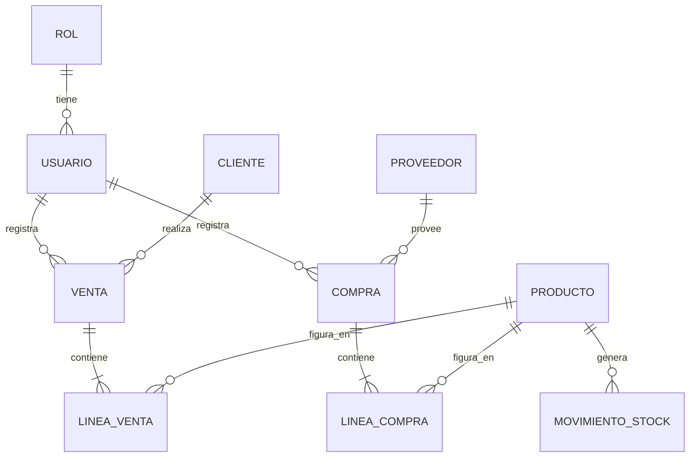
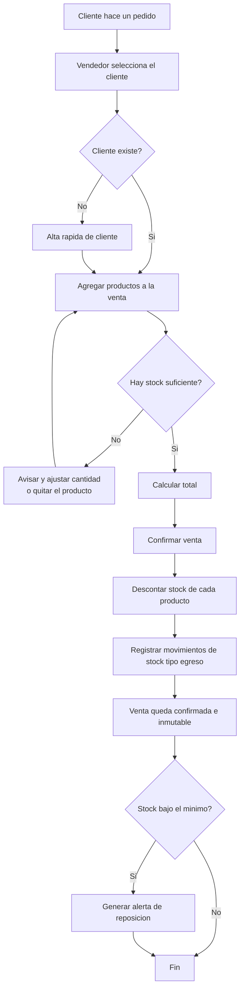
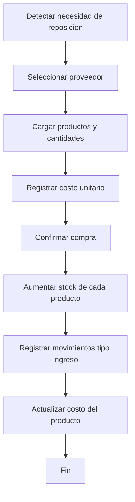
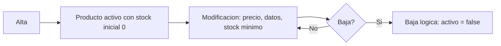
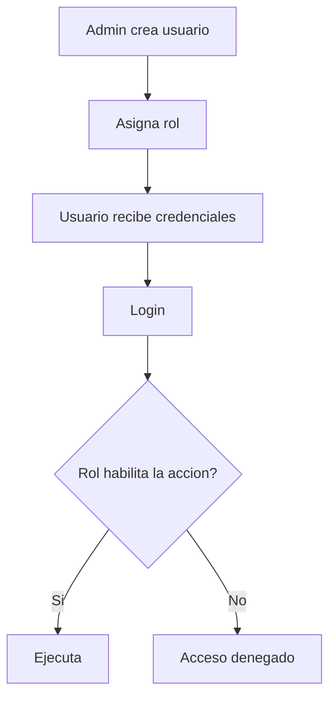

# Modelado de Procesos — ERP grupo21

Trabajo Práctico Integrador · SIMA 2026 · Team **grupo21**

Este documento define **qué hace el ERP** (módulos), **quién lo usa** (actores), **sobre qué datos opera** (entidades) y **cómo fluye el trabajo** (procesos). Es el paso previo al modelo de datos definitivo y a la implementación.

---

## 1. Alcance

El ERP cubre el ciclo comercial básico de una empresa de manufactura: comprar insumos, tenerlos en stock, venderlos y saber en todo momento qué hay y cuánto se movió.

**Módulos:**

| Módulo | Responsabilidad |
| --- | --- |
| **Gestión de clientes** | Alta, consulta y actualización de clientes; historial de compras de cada uno. |
| **Gestión de productos** | ABM de productos, precios, stock actual y punto de reposición. |
| **Administración de usuarios** | Usuarios del sistema, roles y permisos. |
| **Compras y ventas** | Registro de operaciones y su impacto automático sobre el stock. |

**Fuera de alcance** (declarado explícitamente para acotar el TP): contabilidad y libros legales, liquidación de sueldos, planificación de producción (MRP), facturación electrónica ante AFIP/ARCA.

---

## 2. Actores

| Actor | Qué puede hacer |
| --- | --- |
| **Administrador** | Todo. Además: crear usuarios, asignar roles, dar de baja. |
| **Vendedor** | Registrar ventas, gestionar clientes, consultar stock y precios. |
| **Encargado de compras / depósito** | Registrar compras, dar de alta productos, ajustar stock. |
| **Sistema (IA)** | Sugiere reposición, detecta anomalías, responde consultas. No decide solo: siempre propone y un humano confirma. |

Regla transversal: **toda operación queda registrada con el usuario que la hizo y la fecha**. Es lo que hace auditable al ERP.

---

## 3. Entidades principales

| Entidad | Campos clave |
| --- | --- |
| **Usuario** | email, nombre, hash de contraseña, rol, activo |
| **Rol** | nombre (`admin`, `vendedor`, `compras`), permisos |
| **Cliente** | razón social, CUIT/DNI, email, teléfono, dirección, activo |
| **Proveedor** | razón social, CUIT, contacto, activo |
| **Producto** | SKU, nombre, descripción, unidad de medida, precio de venta, costo, **stock actual**, **stock mínimo**, activo |
| **Venta** | cliente, fecha, usuario, total, estado (`borrador` / `confirmada` / `anulada`) |
| **Línea de venta** | producto, cantidad, precio unitario aplicado, subtotal |
| **Compra** | proveedor, fecha, usuario, total, estado |
| **Línea de compra** | producto, cantidad, costo unitario, subtotal |
| **Movimiento de stock** | producto, tipo (`ingreso` / `egreso` / `ajuste`), cantidad, origen (venta/compra/manual), fecha, usuario |

> **Decisión de diseño:** `stock actual` vive en Producto *y además* existe `Movimiento de stock`. El campo es el valor rápido de consulta; la tabla de movimientos es la verdad histórica que permite auditar cómo se llegó a ese número. Nunca se toca el stock sin generar el movimiento correspondiente.

---

## 4. Procesos

### 4.1 Flujo de venta

El proceso central del ERP, el del ejemplo de la consigna.

**Disparador:** un cliente pide productos.

**Reglas de negocio:**
1. No se puede confirmar una venta sin al menos una línea.
2. No se vende más de lo que hay en stock (salvo que el admin habilite venta con stock negativo).
3. El precio se **congela** en la línea al confirmar: si mañana cambia el precio del producto, la venta vieja no se altera.
4. Una venta confirmada no se edita — se **anula**, y la anulación devuelve el stock con un movimiento de ingreso.

**Excepciones:** stock insuficiente · cliente inactivo · producto dado de baja · usuario sin permiso de venta.

---

### 4.2 Flujo de compra

**Disparador:** falta stock (alerta del sistema) o se decide reponer.

**Reglas de negocio:**
1. La compra confirmada **suma** stock; es el espejo de la venta.
2. El costo del producto se actualiza al último costo de compra (criterio simple; alternativa: promedio ponderado).
3. Igual que la venta: confirmada no se edita, se anula.

---

### 4.3 ABM de productos

**Regla clave:** la baja es **lógica**, nunca física. Un producto borrado de verdad rompería el historial de ventas y compras que lo referencian.

El stock **no se edita a mano** desde el formulario del producto: se modifica por compra, por venta o por un **ajuste de inventario** explícito, que exige motivo y queda registrado.

---

### 4.4 Gestión de clientes

Alta → consulta → modificación → baja lógica. Mismo criterio que productos.

Valor agregado del módulo: la ficha del cliente muestra su **historial de ventas**, total comprado y última operación. Eso es lo que lo convierte en gestión de clientes y no en una simple tabla.

---

### 4.5 Administración de usuarios

**Reglas:**
1. Solo el rol `admin` administra usuarios.
2. Un usuario no se borra: se desactiva (sus operaciones históricas deben seguir teniendo autor).
3. Todo endpoint valida rol antes de ejecutar. El control de permisos vive en el servidor, nunca solo en la UI.

---

## 5. Dónde entra la IA

La IA tiene que resolver algo que sin ella sería trabajoso. Tres candidatos, ordenados por relación valor/esfuerzo:

| # | Función | Qué hace | Esfuerzo |
| --- | --- | --- | --- |
| 1 | **Sugerencia de reposición** | Analiza el histórico de ventas por producto y propone qué comprar y cuánto, anticipando el quiebre de stock en vez de reaccionar al mínimo. | Medio |
| 2 | **Consultas en lenguaje natural** | "¿Cuál fue mi producto más vendido en agosto?" → el sistema traduce a consulta sobre los datos y responde. | Medio |
| 3 | **Carga de comprobantes por foto/PDF** | Se sube la factura del proveedor y la IA extrae proveedor, productos, cantidades y costos, precargando la compra para que un humano confirme. | Alto |

**Criterio transversal:** la IA **sugiere, el usuario confirma**. Ninguna de las tres toca stock ni registra operaciones por su cuenta.

---

## 6. Pendiente de definir

- [ ] Stack tecnológico (¿lo impone la cátedra?)
- [ ] ¿Cuál de las tres funciones de IA se implementa?
- [ ] ¿La venta descuenta stock al confirmar o al entregar?
- [ ] ¿Se maneja más de un depósito? (por ahora se asume **uno solo**)
- [ ] Criterio de costeo: último costo vs. promedio ponderado
